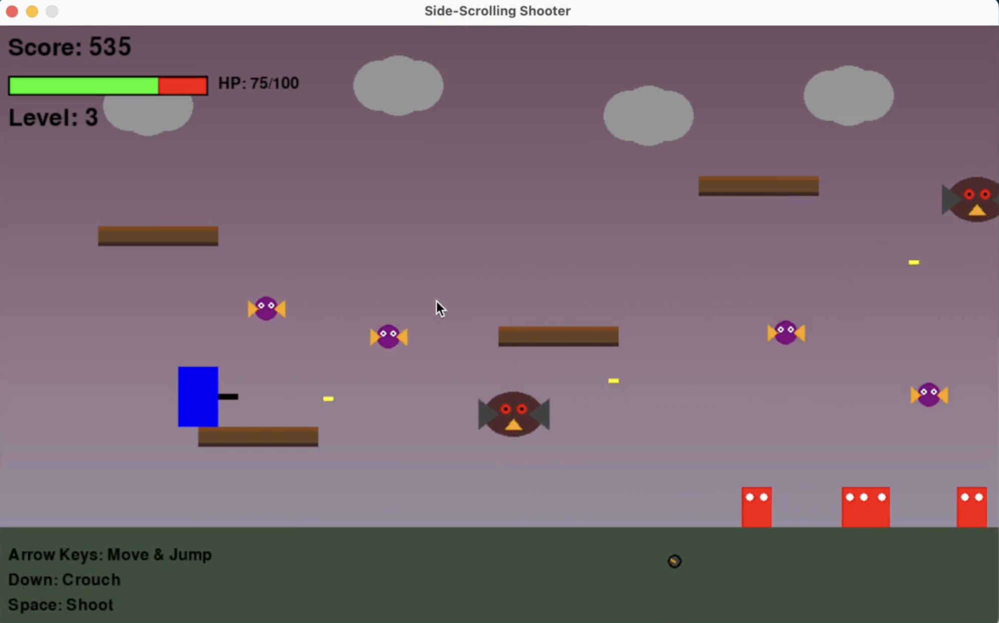

# Forward Blaster



## Game Description

Forward Blaster is an intense 2D side-scrolling shooter built with Python and Pygame (and Claude). Take control of a blue warrior equipped with various powerful weapons as you fight through increasingly challenging levels filled with diverse enemies and obstacles.

## Tips for Success
- Use platforms to avoid ground enemies and position yourself strategically
- Prioritize collecting power-ups for both health restoration and firepower

Survive the onslaught and see how high you can score in this action-packed side-scrolling adventure!

## Gameplay

### Player Controls
- **Arrow Keys**: Move left/right and jump
- **Down Arrow**: Crouch to reduce hitbox
- **Spacebar**: Shoot your weapon

### Game Mechanics
- **Health System**: Start with 100 HP, take damage from enemies, restore health with power-ups
- **Invincibility Frames**: Brief invulnerability after taking damage
- **Platform Navigation**: Jump between platforms to avoid enemies and reach strategic positions
- **Progressive Difficulty**: Each level introduces new enemy types and increased challenges

### Power-Up System
Collect powerful weapon upgrades that appear on platforms:

- **Shotgun (S)**: Fires 5 bullets in a cone pattern for 15 seconds
- **Machine Gun (M)**: Rapid-fire automatic shooting for 7 seconds  
- **Penetrator (P)**: Dual-barrel weapon that fires large bullets penetrating multiple enemies for 12 seconds
- **Rain (R)**: Shoots 15 bullets falling from above for 10 seconds

*Note: All power-ups restore 25 HP when collected and are available from Level 3 onwards*

## Level Progression & Challenges

### Level 1 
- **Enemies**: Basic ground enemies
- **Challenge**: Learn the controls and basic combat

### Level 2 
- **Enemies**: Ground enemies + Flying enemies
- **Challenge**: Multi-directional threats

### Level 3 
- **Enemies**: Ground + Flying + Boss Birds
- **Challenge**: Boss birds drop bombs 
- **New Feature**: Power-ups become available

### Level 4
- **Enemies**: Ground enemies + Jumping Mech Bosses
- **Challenge**: Mechs fire homing missiles 

### Level 5 
- **Enemies**: Boss Birds + Jumping Mechs
- **Challenge**: Lots of tough monsters

### Level 6 - Sky Level
- **Enemies**: Flying enemies only
- **Challenge**: **NO FLOOR** - falling off screen means instant death!
- **Strategy**: Use platforms strategically to stay airborne

### Level 7+ 
- **Enemies**: All enemy types in ultimate difficulty
- **Challenge**: Maximum chaos - survive as long as possible!

### Level ???
- ** ????????????
- ** ????????????
- ** ????????????

## How to Run the Game

### Prerequisites
- Python 3.7 or higher
- Pygame library

### Installation
1. Clone or download the game files
2. Install Pygame:
   ```bash
   pip install pygame
   ```

### Running the Game
```bash
python scroller.py
```

### Development Tools
Format code using Black:
```bash
black .
```
or
```bash
black scroller.py
```
